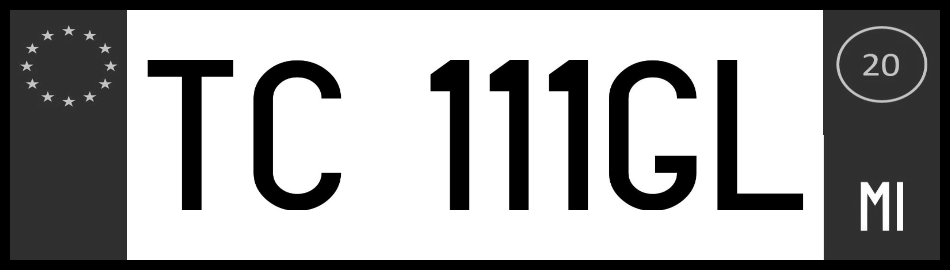

# License plate generator - generates images of automobile license plates, similar to Italian plates

EXPERIMENTAL

1. Clone repository
2. Run python make_plate.py

Command line options
  + --mode         : 'mono' or 'color'
  + --image_scale  : integer value to scale images. 100 is default and corresponds to 1900x540
  + --image_dir    : path of output folder. Images are written to this folder
  + --image_list   : Name of text file which lists generated images.
  + --image_format : jpg = JPEG images, png = PNG images
  + --num_images   : Number of images created

Images should look like this with default options (color, 1950 x 540)

The command line python make_plate.py -m mono -s 50 will produce a monochrome image that is 270 x 950 (i.e. scaled down 50%)

